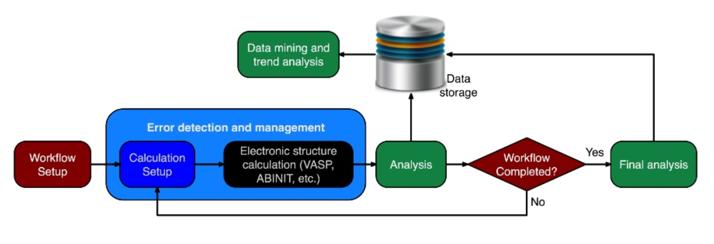

## 材料高通量计算

材料的第一性原理计算，可以不依赖于经验参数，输入元素种类和原子坐标，即可对材料形状进行预测。是加深对材料理解、分析物理性质、设计新材料的重要工具。通过对大量材料的计算，找到适合某种应用的材料。美国、中国相继提出材料基因组计划。在国内外有诸多典型案例，如Materials Project、AFLPWlib、OQMD与Citrine等。

以平面波程序为例，实现计算自动化，需要建立计算流程衔接，晶体及分子数据库的结构信息导入，布里渊区特殊路径，对称性设置，磁性，强关联，赝势库，可视化，错误处理，数据库。

Reference: 

[1] Curtarolo, S. et al, *The high-throughput highway to computational materials design.* Nature Materials **12**, 191-201 (2013). [阅读原文](https://www.nature.com/articles/nmat3568)

[返回首页](./index.md)
