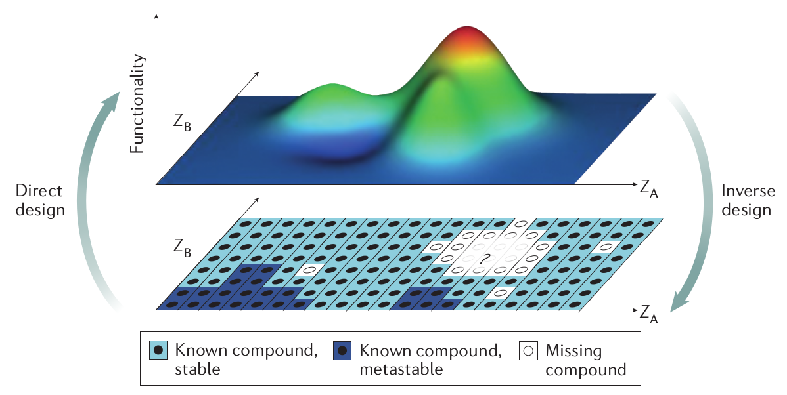

## 材料反向设计

科学家一直在努力寻找拥有奇异特性的材料，以便增强量子计算机、触摸屏和电子显示屏，或让太阳能电池的效率翻倍。细数历史上曾带来技术变革的材料，如灯泡的钨丝、青霉素、聚四氟乙烯（特氟龙）、C60，都是在直觉、试错和幸运的意外中发现的。但是，当前科学家所追求的复杂特性已无法再依赖侥幸获得，而必须从一开始就精心设计。

材料通常由构成它们的原子以及原子的结构和组成来定义。某些材料特性如颜色、硬度、导电性、稳定性、拓扑性质或磁性，只存在于特定物质而非所有物质中。那么问题来了，如何才能找到恰好具备我们所需特性的材料？

全新物质形式的诞生将彻底改变我们对基础物理学的认知，其中包括拥有拓扑性质的材料，这些材料由于原子位置的对称性而能够产生不同寻常的电子特性。其它形式如量子自旋液体和新型超导体也能带来技术变革。几十年前，我们不太费力就能发现具有简单特性的材料；今时今日，只有在材料世界挖得更深，才能找到新的宝藏。

$Vext=∑−Z_alpha/|r-R|$

Reference: 

[1] Zunger, A., *Beware of plausible predictions of fantasy materials.* Nature **566**, 447-449 (2019). [阅读原文](https://www.nature.com/articles/d41586-019-00676-y)

[2] Zunger, A., *Inverse design in search of materials with target functionalities.* [Nat. Rev. Chem. **2**, 0121 (2018)](https://www.nature.com/articles/s41570-018-0121).

[返回首页](./index.md)
